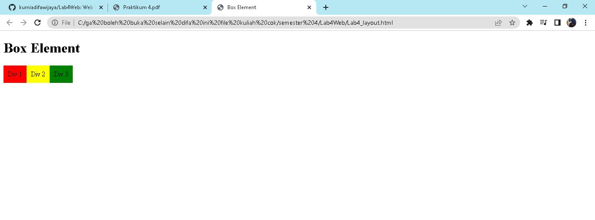
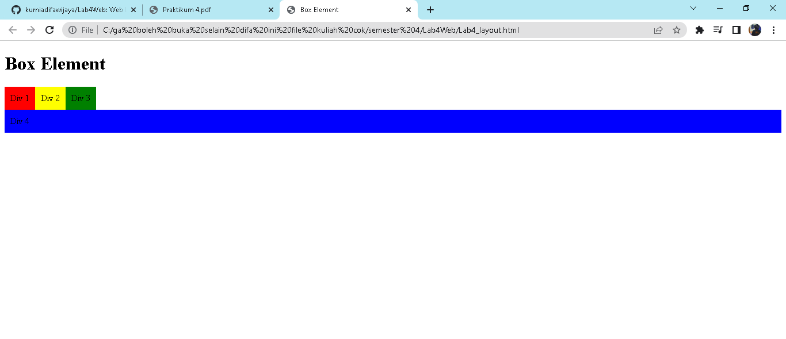

# Lab4Web
Web Layout

**NAMA : Kurnia Difa Wijaya** 
**KELAS : TI 20 B 01** 
**NIM : 312010024**

1. **Membuat Box Element**

pada praktikum kali ini sya akan membuat box element

2. **Mengatur Clearfix Element**

selanjutnya yang harus kita lakukan adalah Mengatur Clearfix Element

3. **Membuat Layout Sederhana**

seteleh mengatur Clearfix Element selanjutnya kuta membuat layout sederhana

